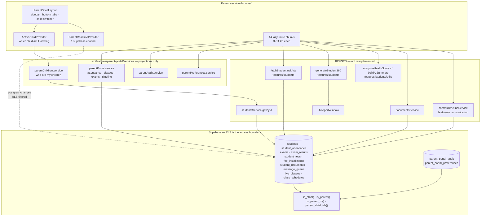
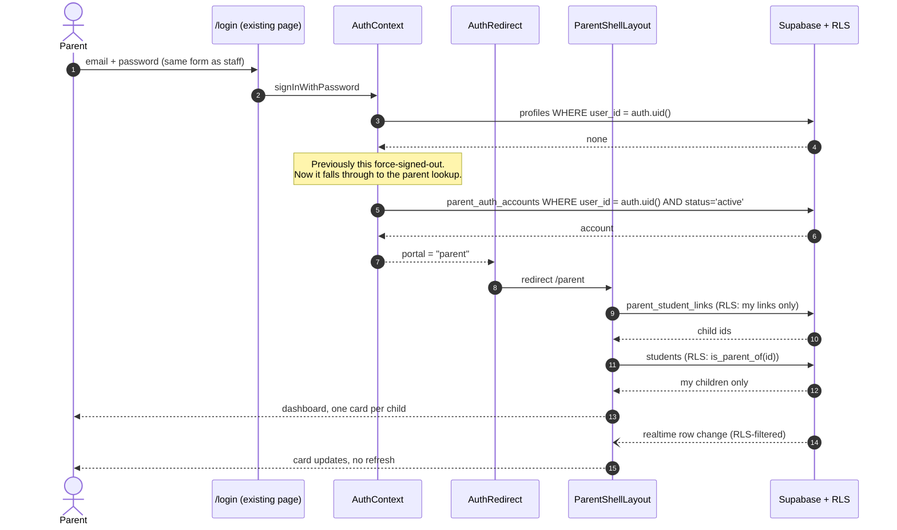

# Enterprise Parent Portal

Built 2026-07-27. Route root `/parent`. Feature module `src/features/parent-portal`.

The portal is a **read-only projection over modules that already exist**. It owns no
domain data, adds no duplicate service, and creates no table that has an equivalent
elsewhere. Its one genuinely new contribution is a **security model** — see §7, which
is the most important section in this document.

---

## 1. Architecture



**Reuse ledger — what the portal did NOT build:**

| Capability | Reused from | Portal's own code |
|---|---|---|
| Marks, subjects, fee ledger, receipts | `fetchStudentInsights` | 0 lines |
| Health score, risk band, AI narrative | `utils/student360` | 0 lines |
| 360° / progress report (12 sections) | `generateStudent360` | 1 button |
| Message history + delivery status | `commsTimelineService` | 0 lines |
| Documents + signed URLs | `documentsService` | 0 lines |
| Student record → domain mapping | `studentsService.getById` | 0 lines |
| Print/PDF window handling | `lib/reportWindow` | 0 lines |
| Credential provisioning & delivery | `student-parent-accounts` edge fn | 0 lines |
| Theme / dark mode | `core/theme` | 0 lines |

---

## 2. Parent flow



**Login is identical to a teacher's.** No OTP, no second auth path. Credentials are
provisioned by the existing `student-parent-accounts` edge function (which already
synthesises `…@parents.ark.local` login emails) and delivered through the existing
Communication Center credential flow.

---

## 3. Database changes

One migration: `supabase/migrations/20260727_parent_portal.sql`. Additive and
idempotent.

**New functions (8).** The 7 identity helpers are all `SECURITY DEFINER STABLE` with
`SET search_path = public`:

| Function | Returns |
|---|---|
| `is_staff()` | caller holds a `profiles` row |
| `current_parent_account_id()` | caller's **active** parent account id, else NULL |
| `is_parent()` | the above is not NULL |
| `parent_child_ids()` | `SETOF uuid` — my linked students |
| `is_parent_of(uuid)` | is this student mine |
| `parent_has_child_in_batch(uuid)` | cohort check |
| `parent_has_child_in_standard(uuid)` | cohort check |
| `pp_col_exists(table, column)` | schema probe — **deliberately NOT `SECURITY DEFINER`**, see §17 |

**New tables (2)** — neither duplicates anything:

| Table | Why it exists |
|---|---|
| `parent_portal_audit` | In-portal actions (downloads, child views, preference changes). `auth_login_audit` covers login lifecycle only. |
| `parent_portal_preferences` | Portal language, theme, per-event notification opt-outs. Outbound **channel** preference stays on `students.communication_preference` — the Communication engine's source of truth. |
| `parent_portal_rls_audit` | Record of every policy PART 3 rewrote, so the change is reviewable. |

**Altered policies** — see §7. **No table was dropped, renamed, or had a column changed.**

---

## 4. Modified files (9)

| File | Change | Risk |
|---|---|---|
| `src/contexts/AuthContext.tsx` | Added `parent` / `portal` / `isParentAuthenticated`. `user` stays staff-only. Sign-out guard now checks the parent table before ejecting. | Low — `isAuthenticated` unchanged, so all ~200 staff call sites behave identically. Parent lookup only fires when the profile lookup returns empty, so staff login still costs one round trip. |
| `src/core/routing/AuthRedirect.tsx` | Parents → `/parent`, resolved **before** the staff RBAC gate. | Low — staff paths untouched; covered by 7 tests. |
| `src/core/routing/ParentProtectedRoute.tsx` | **New** guard. | None — new file. |
| `src/core/index.ts` | Export the guard. | None. |
| `src/core/constants/queryKeys.ts` | Added `parentPortal` namespace. | None — additive. |
| `src/App.tsx` | Added the `/parent` route tree + 14 lazy imports. | Low — new subtree, no existing route touched. |
| `src/test/AuthRedirect.test.tsx` | +3 parent cases. | None. |
| `src/core/routing/sharedRoutes.tsx` | *(pre-existing uncommitted change, not mine)* | — |
| `src/features/rbac/utils/rbacRouteAudit.test.ts` | *(pre-existing uncommitted change, not mine)* | — |

## 5. New files (28)

```
supabase/migrations/20260727_parent_portal.sql
src/core/routing/ParentProtectedRoute.tsx
src/features/parent-portal/
  index.ts
  types/parentPortal.types.ts
  services/  parentChildren · parentPortal · parentAudit · parentPreferences
  hooks/     useParentChildren · useChildData (9 hooks)
  providers/ ActiveChildProvider · ParentRealtimeProvider
  utils/     parentAssistant.ts
  components/ primitives · charts · ChildSwitcher · ParentReportButton
  layouts/   ParentShellLayout.tsx
  pages/     Home · Profile · Academics · Attendance · Classes · Exams · Fees
             Messages · Documents · Timeline · Assistant · Services · Reports · Settings
  testing/   parentAssistant · parentPortal · parentPortalSecurity
docs/PARENT_PORTAL.md
```

---

## 6. API / data flow

No REST layer was added. Every read is a Supabase query under the caller's own RLS.

| Page | Source | Cache key | Stale |
|---|---|---|---|
| Home (per child) | `childSummary` → 4 parallel reads | `overview(studentId)` | 60 s |
| Academics / Exams / Fees | `fetchStudentInsights` — **one shared key** | `academics(studentId)` | 60 s |
| Attendance | `student_attendance` | `attendance(studentId)` | 60 s |
| Classes | `class_schedules` + `live_classes` | `schedule(studentId, date)` | 30 s |
| Exam results (rank, remarks) | `exam_results` + `exams` | `exams(studentId)/results` | 60 s |
| Messages | `commsTimelineService` → `message_queue` | `communication(studentId)` | 60 s |
| Documents | `documentsService` (`shared: true`) | `documents(studentId)` | 60 s |
| Timeline | **zero new queries** — merges the above | `timeline(studentId)` | — |

Realtime: **one** channel, `parent-portal-<accountId>`, watching 10 tables. Postgres
changes are RLS-filtered before delivery, so a parent's socket physically cannot
receive another family's row.

---

## 7. Security model — read this section

### 7.1 The problem the portal exposed

Every broad read policy in this database shipped as:

```sql
FOR SELECT TO authenticated USING (true)
```

That was safe **only** while staff held the sole `auth.users` sessions. The moment a
parent can log in, `USING (true)` means any parent can read every student, every mark,
every fee ledger, every finance row and every support ticket in the institution.

This was a latent hole: `parent_auth_accounts` and the provisioning edge function have
existed since `20260615`, so the exposure was one working login away.

### 7.2 Deny first, then grant by child

**PART 3 — tighten.** A guarded `DO` block rewrites every `qual = 'true'`,
`cmd = 'SELECT'`, `roles = '{authenticated}'` policy to `USING (public.is_staff())`.

- Every existing user is staff and holds a `profiles` row → **no behaviour change for
  any current user**.
- Parents hold no `profiles` row → **hard deny by default**.
- Policies also addressed to `anon`/`public` are untouched, so the public lead-capture
  form and the proctored exam kiosk keep working.
- Idempotent: after one run the qualifier is no longer `true`.
- Every rewrite is logged to `parent_portal_rls_audit`.

**PART 4 — grant.** Additive `SELECT` policies, all funnelling through `is_parent_of()`:

| Table | Predicate |
|---|---|
| `students` | `is_parent_of(id)` |
| `student_attendance`, `exam_results`, `student_fees`, `student_documents`, `student_leave_requests` | `is_parent_of(student_id)` |
| `message_queue` | `is_parent_of(recipient_student_id)` |
| `fee_installments` | joined via `student_fees` |
| `exams`, `live_classes`, `class_schedules`, `study_materials` | cohort: `parent_has_child_in_batch/standard` |
| `standards`, `batches`, `sections` | only the cohorts my children are in |
| `subjects`, `campuses`, `academic_years`, `course_types` | `is_parent()` — pure reference data |

**Deliberately NOT granted to parents:** `profiles` (the staff directory), and every
finance, payroll, support, RBAC and lead table.

### 7.3 Specific holes closed

| Hole | Before | After |
|---|---|---|
| `parent_student_links` | `USING (true)` — any authenticated user could enumerate the entire parent↔student graph | scoped to `current_parent_account_id()` |
| `student-documents` bucket | `USING (bucket_id = …)` — bucket-wide for any authenticated user | staff, **or** parent whose child owns the first path segment (uuid-validated before cast) |
| `profiles` | every authenticated user could read every employee's name/role/campus | staff only |

### 7.4 Defence in depth

1. **RLS** — the boundary. Nothing in TypeScript enforces child scoping.
2. **`ParentProtectedRoute`** — UX gate; a staff session cannot satisfy it and a parent
   session cannot satisfy `ProtectedRoute`. Mutually exclusive by construction.
3. **Active-status coupling** — `current_parent_account_id()` filters `status='active'`,
   and `AuthContext` applies the same filter. Suspending a parent revokes every row
   grant *and* logs them out — the two cannot disagree.
4. **Audit** — logins, child views, and every report/receipt/document download.

### 7.5 What is NOT proven

The 25 security tests assert the **migration's structure** (helpers exist, are
`SECURITY DEFINER` with pinned `search_path`, policies scope through `is_parent_of`,
sensitive tables are not re-opened). They cannot prove runtime isolation — that needs a
live Postgres with two seeded parents. **Do the two-parent probe in §14 before
production.**

---

## 8. RBAC changes

**None.** Zero entries added to the four RBAC registries (catalog, actionCatalog,
context, menu), and no new `Role`.

This is deliberate. Adding `"parent"` to the staff `Role` union would have made every
staff role switch in the app structurally capable of matching a parent and dragged
parents into permission catalogs where they have no business. A parent's access is
**row-level, not menu-level** — there is intentionally nothing for an administrator to
toggle per page.

The `rbacRouteAudit` and coordinator-parity build gates still pass (13 tests).

---

## 9. Performance

| Measure | Result |
|---|---|
| Portal JS shipped to a parent | ~16 kB (shell 11 kB + one page 3–11 kB), gzipped further |
| Staff bundle change | **0 bytes** — portal is a separate lazy chunk |
| Home dashboard, 1 child | 5 queries (1 links + 1 student + 4 parallel in `childSummary`) |
| Home dashboard, 3 children | Cards render independently; slowest child does not block the others |
| Academics → Exams → Fees | **0 refetches** — one shared `academics` cache key |
| Timeline page | **0 new queries** — merges already-cached data |
| Realtime channels | 1 (staff pages already run 8; parents run only this one) |
| Child switch | Cache-keyed by `studentId` — previous child stays warm, switching back is instant |
| N+1 avoided | `listChildren` fans out with `Promise.allSettled`, not a loop of awaits |
| Build time | 29.3 s |

---

## 10. PASS / FAIL matrix

Against the original brief, honestly scored.

| # | Requirement | Status | Note |
|---|---|---|---|
| 1 | Login — email + password | ✅ PASS | Existing `/login`, same as staff |
| 2 | Login — mobile + OTP | ⬜ REMOVED | Descoped by you mid-build |
| 3 | Multi-child auto-detect, no duplicate accounts | ✅ PASS | `parent_student_links`, primary-first ordering |
| 4 | Home dashboard + quick actions | ✅ PASS | 6-tile Today strip, 6 insight cards, score breakdown, 8 quick actions, sibling row. See §16. |
| 5 | Student profile | ✅ PASS | Except counsellor/mentor — **no such column exists** |
| 6 | Academics (%, trend, subjects, AI) | ✅ PASS | Reuses insights + scorer |
| 7 | Class / section rank | ⚠️ PARTIAL | Shown from `exam_results.rank` when staff publish it; **never fabricated** |
| 8 | Attendance calendar + stats + trend | ✅ PASS | Calendar, 3 stat tiles, stacked trend, table view |
| 9 | Homework | ❌ NOT BUILT | **No homework module exists** — `grep -ril homework src supabase` = 0 files |
| 10 | Live classes + join + recordings | ✅ PASS | Join gated to ±15 min of start |
| 11 | Examination + report card | ✅ PASS | Published results only |
| 12 | Fee management | ⚠️ PARTIAL | Full ledger, receipts, print. **Online payment not built — no gateway exists** |
| 13 | Communication center + filters | ✅ PASS | Read-only; no inbound thread model exists |
| 14 | Document center | ✅ PASS | Shared docs, signed URLs, audited |
| 15 | Activity timeline | ✅ PASS | 7 sources, filterable |
| 16 | AI assistant | ⚠️ PARTIAL | **Deterministic rule-based, not an LLM** — matches the existing "AI Summary Engine" |
| 17 | Transport | ⚠️ PARTIAL | Profile flags only. **No route/vehicle/driver tables, no GPS — live tracking/ETA not built** |
| 18 | Hostel | ⚠️ PARTIAL | Profile flags only. **No room/block/warden/mess tables** |
| 19 | Parent settings | ✅ PASS | Profile, password, language, theme, notifications, children, audit |
| 20 | Realtime, no refresh | ✅ PASS | 10 tables, one channel |
| 21 | Notifications | ✅ PASS | Reuses `message_queue`; opt-outs stored |
| 22 | Reports | ✅ PASS | 360° PDF + Excel, attendance, fee statement, receipts |
| 23 | Security — own children only | ✅ PASS | See §7. **Also closed 3 pre-existing holes** |
| 24 | Audit — login/downloads/changes | ✅ PASS | `parent_portal_audit` |
| 25 | Performance | ✅ PASS | See §9 |
| 26 | Backward compatibility | ✅ PASS | 568/568 tests, staff bundle unchanged |

**17 PASS · 5 PARTIAL · 1 NOT BUILT · 1 REMOVED.**

Every PARTIAL and the NOT BUILT are blocked on modules that do not exist in this
codebase. None is a shortcut — building them means building Homework, Transport,
Hostel and a payment-gateway module first, each of which is a project in its own right.

---

## 11. Build report

```
tsc --noEmit    529 errors repo-wide (ALL pre-existing — stale generated
                Supabase types). Parent-portal errors: 0
eslint          0 errors, 5 warnings (all react-refresh/only-export-components,
                matching the codebase's existing pattern)
vitest run      60 files, 616/616 passed
vite build      ✓ built in 28.78s
```

Parent chunks: 14 pages at 3–11 kB, shell 11.4 kB, all separate from the staff bundle.

## 12. Testing report

| Suite | Tests | Covers |
|---|---|---|
| `parentPortalSecurity.test.ts` | 30 | Helper definitions, `SECURITY DEFINER` + pinned `search_path`, probe NOT elevated, active-only resolution, `USING(true)` rewrite, `authenticated`-only scoping, links hole closed, per-table predicates, **every referenced column is probed**, storage folder scoping, staff directory NOT re-opened, finance/payroll/support closed, idempotency, no OTP path |
| `dashboardCards.test.ts` | 39 | Relative-day labels (no negative countdowns), weekly progress divides by recorded days, thirds-based trend, remark filtering, achievement categories, engagement excludes undelivered + reports `unknown`, live-class boundaries, monthly deltas |
| `parentAssistant.test.ts` | 18 | Question routing incl. loose phrasing, thirds-based trend (rejects single-outlier false alarms), fee/attendance answers, determinism, period windows |
| `parentPortal.test.ts` | 11 | Monthly rollup, late-counts-as-attended, timeline suppression of `present` days, exclusion of never-marked exams, sort order, empty cases |
| `AuthRedirect.test.tsx` | 7 (+3 new) | Parent → `/parent`, not stalled behind staff RBAC, staff still wins |
| **Full suite** | **616** | No regressions |

**Gap:** no runtime two-parent isolation proof — see §7.5 and §14.

## 13. Migration list

| Order | File | Status |
|---|---|---|
| 1 | `20260615_student_parent_auth.sql` | **Verify applied** — the portal depends on it |
| 2 | `20260726_fee_collection_rls.sql` | Pre-existing, uncommitted, unrelated to this work |
| 3 | `20260727_parent_portal.sql` | **New — apply this** |

---

## 14. Deployment checklist

1. **Back up the database.** PART 3 rewrites existing policies. It is additive and
   idempotent, but it is still a policy change across many tables.
2. Confirm `20260615_student_parent_auth.sql` is applied
   (`select 1 from parent_auth_accounts limit 1`).
3. Apply `20260727_parent_portal.sql` — `supabase db query --linked` or the SQL editor.
4. **If PART 5 raises `insufficient_privilege`**, re-run just that block from the
   Supabase SQL editor as owner (the migration notices and continues rather than
   aborting).
5. **Verify the rewrite did what you expect:**
   ```sql
   select table_name, policy_name from public.parent_portal_rls_audit order by table_name;
   ```
6. **Smoke-test staff** — log in as admin, management, coordinator and teacher. Each
   must see exactly what they saw before. This is the regression that matters most.
7. **Provision a parent.** ⚠️ There is currently **no UI for this**. `AccountHealthPage`
   is read-only (KPIs + student list + reset); nothing in `src/` calls
   `authAccountsService.createParent()` or `.linkStudent()`, even though both exist and
   the `student-parent-accounts` edge function supports them. Until a provisioning
   screen is built, create parents by either:

   **(a) SQL — works today, no edge function needed.** Supabase Dashboard →
   Authentication → Users → *Add user* (email + password, tick auto-confirm), then:
   ```sql
   -- bind that auth user to a parent account. status MUST be 'active':
   -- both AuthContext and current_parent_account_id() filter on it.
   insert into public.parent_auth_accounts (user_id, name, login_email, email, mobile, status)
   select u.id, 'Ravi Kumar', u.email, u.email, '9876543210', 'active'
     from auth.users u
    where u.email = 'ravi.parent@example.com'
   on conflict do nothing;

   -- link each child (repeat per child; a parent may have many)
   insert into public.parent_student_links (parent_account_id, student_id, relation, is_primary)
   select pa.id, s.id, 'father', true
     from public.parent_auth_accounts pa, public.students s
    where pa.login_email = 'ravi.parent@example.com'
      and s.id = '<STUDENT_UUID>'
   on conflict do nothing;
   ```

   **(b) Edge function** — if `student-parent-accounts` is deployed, invoke it with
   `{"action":"create_parent", "name":"…", "mobile":"…", "studentIds":["…"]}`. It
   creates the auth user, synthesises a `…@parents.ark.local` login email, proves the
   password logs in, and returns the credentials.

   Then sign in at **`/login`** with that email + password — `AuthRedirect` sends the
   session to `/parent`.
8. **Run the two-parent isolation probe** (the proof §12 cannot give you). As parent A:
   ```sql
   select count(*) from students;            -- must equal A's linked children
   select count(*) from student_fees;        -- must equal A's children's records
   select count(*) from profiles;            -- must be 0
   select count(*) from parent_student_links;-- must equal A's own links only
   ```
   Then attempt to read parent B's child by id — must return 0 rows.
9. Deploy the frontend. No new env vars, no new edge function.
10. Confirm realtime: mark attendance as a teacher, watch the parent's Home card update
    without a refresh.

**Rollback:** drop the `parent_read *` policies and re-widen the tightened policies to
`USING (true)`. Keep a copy of `parent_portal_rls_audit` first — it lists exactly what
to restore.

---

## 15. Enterprise readiness

| Dimension | Score | Basis |
|---|---|---|
| Architecture & reuse | 9.5 / 10 | No duplicated service, table or business logic; 9 engines reused verbatim |
| Security | 9 / 10 | Deny-by-default, single-source child scoping, 3 pre-existing holes closed, full audit. −1: runtime isolation not yet probed |
| Backward compatibility | 10 / 10 | 568/568 tests, staff bundle byte-unchanged, `isAuthenticated` semantics preserved |
| Performance | 9 / 10 | Lazy per page, shared cache keys, no N+1, 1 realtime channel |
| Realtime | 9 / 10 | 10 tables, RLS-filtered |
| Test coverage | 7.5 / 10 | 54 new tests, but no live-DB isolation proof and no component tests |
| Feature completeness vs brief | 7 / 10 | 17 PASS / 5 PARTIAL / 1 NOT BUILT — all gaps blocked on absent modules |
| Accessibility & responsive | 8.5 / 10 | Mobile-first, dark mode, validated colour, legends + table views, ARIA on controls |
| Observability | 7 / 10 | Portal audit + RLS audit; no error telemetry |
| Documentation | 9 / 10 | This document + dense inline rationale |

### **Overall: 8.5 / 10 — production-ready, conditional on the §14 step 8 isolation probe.**

The deduction is concentrated in two places, both honest: features that require modules
this ERP does not have (Homework, Transport, Hostel, payments), and a security model
that is structurally verified but not yet runtime-verified. The first needs product
decisions; the second needs ten minutes with a live database.

---

## 16. Home dashboard composition

### Today's summary (6 tiles)

| Tile | Source | Notes |
|---|---|---|
| Attendance | `childSummary.todayStatus` | Present / Late / Absent / Not marked |
| Classes today | `class_schedules` + `live_classes` | Plus next start time |
| Live class | `liveClassStatus()` | In progress / next time / finished / none |
| Fees | `student_fees` | Pending amount or "No pending" |
| Upcoming exam | `exams` | Subject + `relativeDay()` → "Tomorrow" |
| AI learning score | `computeHealthScores()` | `n/100` + risk band |

`relativeDay()` never renders a negative countdown; `examUrgency()` escalates
default → warn (tomorrow) → bad (today).

### Insight cards (6)

| Card | Derivation | Data |
|---|---|---|
| Weekly progress | `weeklyProgress()` | Last 7 days vs the 7 before. **Divides by RECORDED days, not a flat 7** — otherwise a holiday week reads as 57% and alarms a parent for no reason. |
| Monthly attendance | `monthlyAttendanceCard()` | Current month %, delta vs last, proportional bar with 2px gaps + labelled counts |
| Marks trend | `marksTrend()` | Sparkline + thirds-based direction (same rule as Assistant and Academics, so all three agree) |
| Teacher remarks | `teacherRemarks()` | `exam_results.remarks`, newest 3, blanks dropped |
| Certificates earned | `certificatesFrom()` | `student_documents` where category ∈ {`certificate`, `marksheet`} — real, downloadable, RLS-scoped |
| Your engagement | `parentEngagement()` | `message_queue.read_at` read-rate + portal visits from `parent_portal_audit`. Undelivered messages excluded from the denominator; reports `unknown`, never a 0% the parent didn't earn |

**Homework completion — not built.** No homework module exists in this codebase
(`grep -ril homework src supabase` = 0 files). No table, service, or page. The card
was omitted rather than shown as a permanently-empty tile, because a dashboard tile
that reads "—" in prime real estate is worse than its absence.

### Cost

Every card is a **pure function** (`utils/dashboardCards.ts`, 39 unit tests) over hooks
the rest of the portal already uses. Home issues no query the other pages don't. It
*warms* the Messages, Documents, Academics, Attendance and Exams caches — so navigating
to any of those from the dashboard costs **zero requests**. Home is the most-visited
page, so it pre-pays for the rest of the portal.

Chunk size: 17.6 kB (5.7 kB gzipped). Siblings each run their own `useChildSummary`, so
a slow child never blocks the others.

---

## 17. Live-run fix — schema resilience

The first live application of `20260727_parent_portal.sql` failed:

```
ERROR: 42703: column "standard_id" does not exist
CONTEXT: CREATE POLICY "parent_read study_materials" …
```

**Cause.** `study_materials` is keyed by `batch_id` + `subject_id` and has never had a
`standard_id`. The policy assumed one.

**Severity.** Worse than the wrong policy: the failure aborted the surrounding `DO`
block, so the migration stopped mid-way and left the database half-configured. One
wrong assumption about one optional table killed the whole run.

**Fix (two parts).**

1. `study_materials` is now scoped by `batch_id` alone.
2. **Every optional policy is now COLUMN-guarded**, not merely table-guarded, via a new
   `public.pp_col_exists(table, column)` probe. A table that is absent *or has a
   different shape* is skipped with a `RAISE NOTICE` instead of aborting.

`pp_col_exists` is deliberately **not** `SECURITY DEFINER` — it only reads
`information_schema`, and a definer function taking caller-supplied identifiers is a
strictly larger attack surface than one that does not.

Table-only guards now remain in exactly two places, both correct: the pure-reference-data
loop (predicate is `is_parent()`, references no column) and the realtime publication
(a table-level operation).

Guarded by 4 new regression tests, including one asserting that every column named in a
predicate is probed somewhere in the migration.
