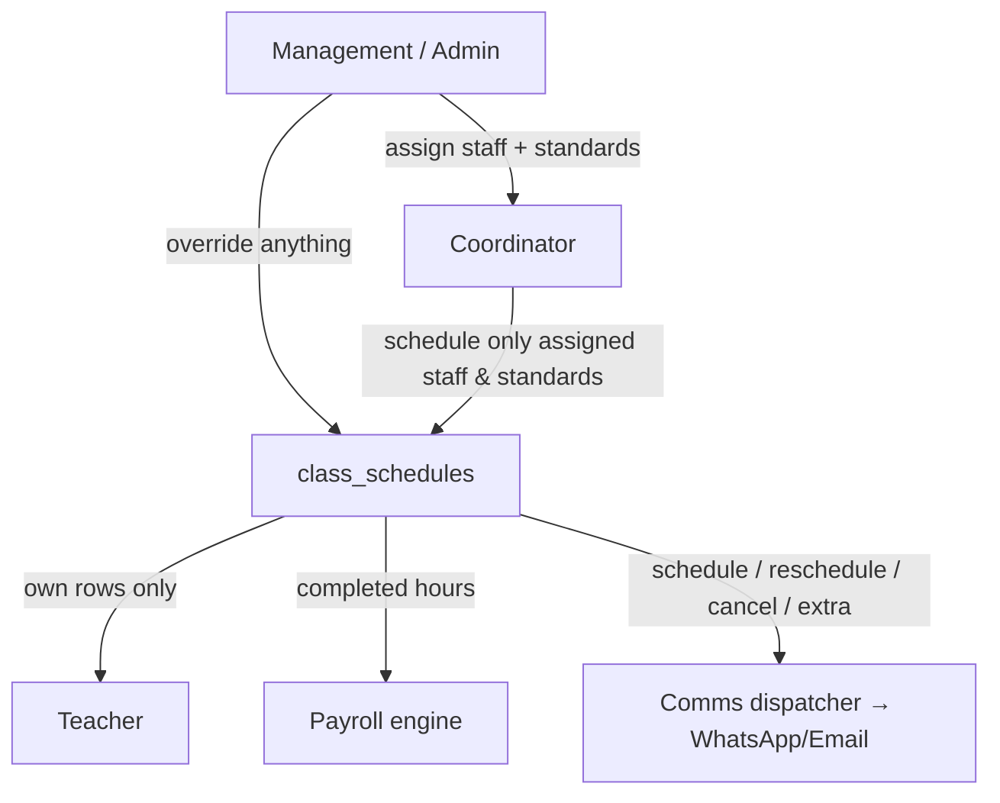
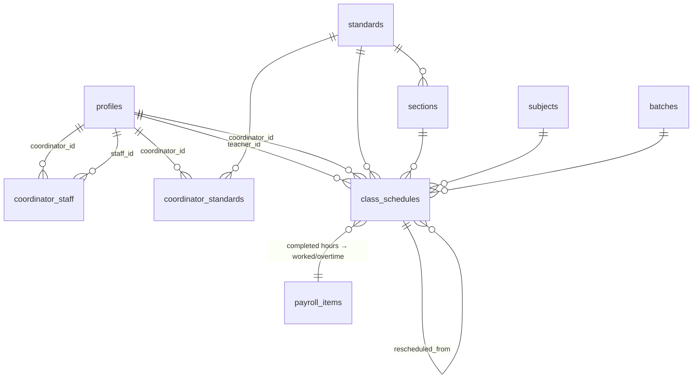
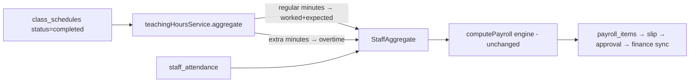
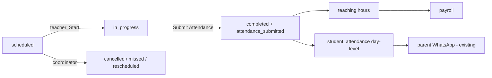
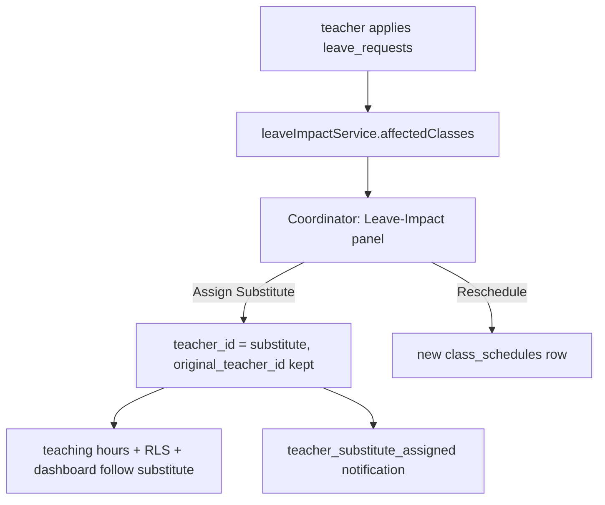
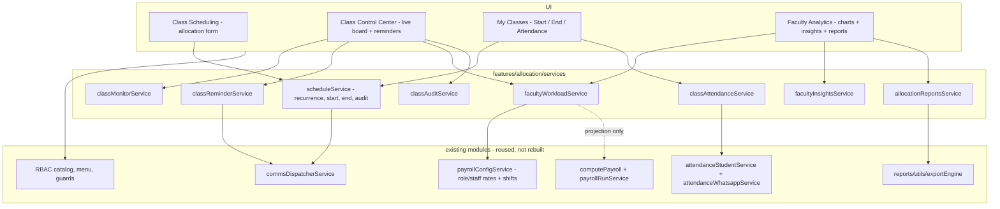
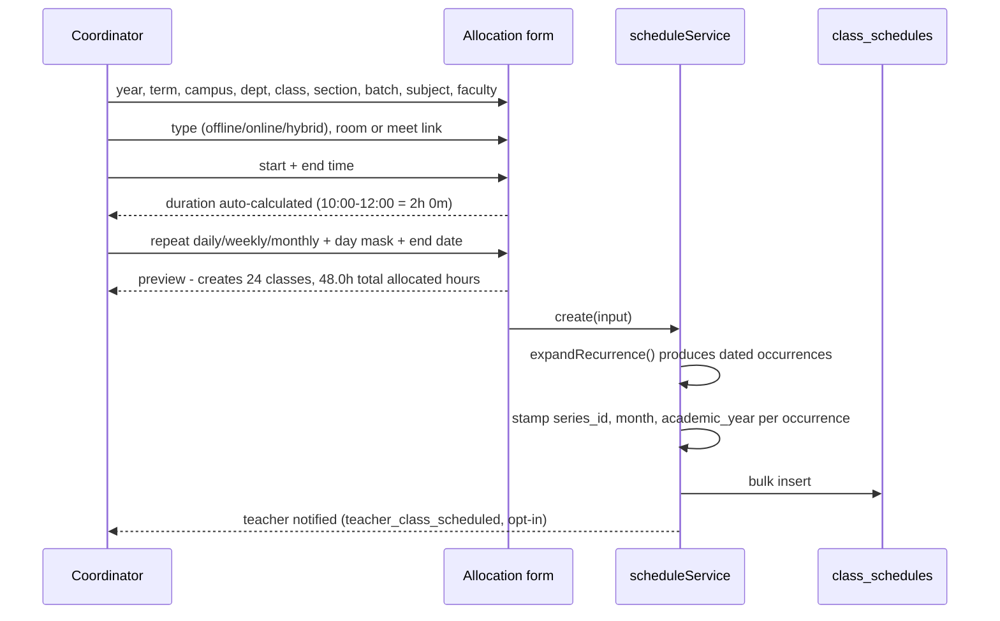
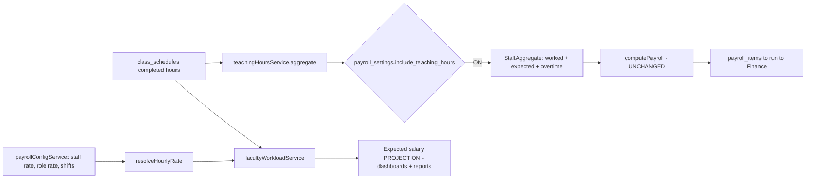
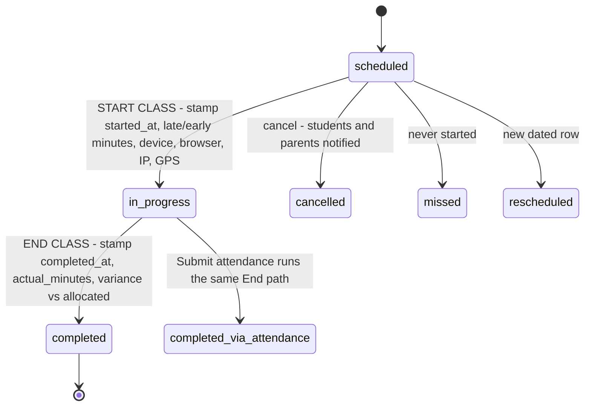
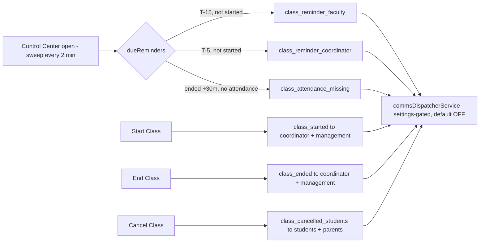

# Enterprise Academic Allocation Module

Coordinator management → class scheduling → teacher timetable → salary automation.
Fully dynamic (unlimited coordinators / standards / sections / teachers / batches),
RBAC-gated, built by **extending** the existing Payroll, Attendance, Communication,
RBAC and Dashboard modules — no duplicate engines.

> **Status:** Foundational core (Pass 1). Migration authored but **not applied**
> (`supabase/migrations/20260723_academic_allocation.sql`) — every service is
> missing-table-safe, so the app builds/runs before it is applied. Reports,
> analytics dashboards and the enterprise-readiness score are a follow-up pass.

---

## Role hierarchy



| Role | Can |
|------|-----|
| **Management/Admin** | Create coordinators (staff role), assign/transfer staff ↔ coordinators, assign standards, override schedules & payroll, org-wide view |
| **Coordinator** | Manage **only assigned** staff — assign standards/sections/subjects/timings, schedule/modify/cancel classes, approve extra classes, view workload & salary hours |
| **Teacher** | View **only own** classes, timetable, teaching + salary + extra hours, notifications |

---

## ER diagram



**New tables**

| Table | Purpose | Key columns |
|-------|---------|-------------|
| `sections` | dynamic sections per standard | `standard_id, name, sort_order` |
| `coordinator_staff` | staff ↔ coordinator (M2M) | `coordinator_id, staff_id, is_active` (UNIQUE pair) |
| `coordinator_standards` | coordinator scope (M2M) | `coordinator_id, standard_id` (UNIQUE pair) |
| `class_schedules` | the timetable | `teacher_id, coordinator_id, standard/section/subject/batch, schedule_date, start/end_time, duration_minutes (STORED generated), mode, room, meeting_link, repeat_weekly, is_extra, status` |

**New column:** `payroll_settings.include_teaching_hours` (bool, default false).

---

## Salary automation flow



Gated by `payroll_settings.include_teaching_hours`. When off, payroll behaves exactly
as before. The shared `computePayroll()` engine, slips, approval and finance-sync are
untouched — teaching hours simply feed the same `StaffAggregate` attendance already fills.

---

## RBAC permission matrix

Module `academics` (registered in `catalog.ts` + `actionCatalog.ts` + `menu.config.ts`;
build-gated by `registryAudit.test.ts` / `rbacRouteAudit.test.ts`).

| Action | Management | Coordinator | Teacher |
|--------|:--:|:--:|:--:|
| `academics.allocate_staff` | ✅ | — | — |
| `academics.transfer_staff` | ✅ | — | — |
| `academics.assign_standards` | ✅ | — | — |
| `academics.manage_sections` | ✅ | — | — |
| `academics.schedule_class` | ✅ (override) | ✅ | — |
| `academics.reschedule_class` | ✅ | ✅ | — |
| `academics.cancel_class` | ✅ | ✅ | — |
| `academics.extra_class` | ✅ | ✅ | — |
| `academics.view_workload` | ✅ | ✅ | — |
| `academics.view_my_classes` | — | — | ✅ |
| `academics.override` | ✅ | — | — |

Enforced at the DB by RLS on `class_schedules` (teacher → own rows; coordinator →
`coordinator_manages_staff()` + `coordinator_owns_standard()`; management/admin → all).

---

## Notifications (reuses comms dispatcher)

Events added to `communication/constants/automationEvents.ts`, recipient = teacher
(`profiles.mobile`), gated by `comms_automation_settings` (default OFF):
`teacher_class_scheduled`, `teacher_class_rescheduled`, `teacher_class_cancelled`,
`teacher_extra_class`. The teacher's live "My Classes" row is the in-app notification
(the shared `notifications` table is not teacher-readable by RLS).

---

## API surface (services)

| Service | Methods |
|---------|---------|
| `allocationService` | `listStaffLinks`, `staffIdsForCoordinator`, `assignStaff`, `removeStaff`, `transferStaff`, `listStandardLinks`, `standardIdsForCoordinator`, `assignStandard`, `removeStandard`, `listSections`, `createSection`, `deleteSection` |
| `scheduleService` | `list`, `get`, `create` (weekly-expand + notify), `update`, `setStatus`, `reschedule`, `remove` |
| `teachingHoursService` | `aggregate(from,to)`, `forTeacher(id,from,to)` |

Hooks: `useStaffLinks`, `useStandardLinks`, `useSections`, `useMyManagedStaffIds`,
`useMyStandardIds`, `useAllocationMutations`, `useSchedules`, `useMySchedule`,
`useScheduleMutations`, `useTeachingHours`, `useMyTeachingHours`.

---

## Modified / new files

**New**
- `supabase/migrations/20260723_academic_allocation.sql`
- `src/features/allocation/**` (types, services ×3, hooks ×3, schema, `pages/MyClassesPage.tsx`, tests ×2)
- `src/pages/management/StaffAllocation.tsx`
- `src/pages/coordinator/ClassScheduling.tsx`
- `docs/academic-allocation.md`

**Extended**
- RBAC: `rbac/constants/catalog.ts`, `actionCatalog.ts`
- Nav: `core/navigation/menu.config.ts`; keys: `core/constants/queryKeys.ts`
- Routing: `src/App.tsx` (teacher `my-classes`, coordinator/management `scheduling`, management `allocation`)
- Payroll: `payrollRun.service.ts` (teaching-hours merge), `payrollConfig.service.ts`, `types/payroll.types.ts`, `pages/PayrollSettingsPage.tsx`
- Comms: `communication/constants/automationEvents.ts`

---

## PASS / FAIL implementation matrix (Pass 1)

| # | Requirement | Status |
|---|-------------|:--:|
| 1 | Management assigns staff → coordinator (M2M) | ✅ |
| 2 | Transfer staff between coordinators | ✅ |
| 3 | Coordinator sees only assigned staff (RLS) | ✅ |
| 4 | Coordinator assigns standards/sections/subjects/timings | ✅ |
| 5 | Many-to-many everywhere (staff↔coord, coord↔standard, teacher↔standard) | ✅ |
| 6 | Dynamic — no hardcoded coordinators/standards/ranges | ✅ |
| 7 | Class timetable (offline/online, room, link, duration, statuses, weekly repeat) | ✅ |
| 8 | Status transitions: scheduled/completed/cancelled/missed/rescheduled | ✅ |
| 9 | Extra-class workflow + instant teacher notification | ✅ |
| 10 | Teacher dashboard: today/upcoming/completed/extra + salary hours | ✅ |
| 11 | Coordinator workload view (hours per teacher) | ✅ |
| 12 | Salary auto-accrual from completed teaching hours → payroll | ✅ (opt-in flag) |
| 13 | Notifications via WhatsApp/Email (settings-gated) | ✅ |
| 14 | RBAC registered + build-gated | ✅ |
| 15 | Unit tests (aggregation, weekly-expand) | ✅ |
| 16 | Management dashboard analytics (coordinator/teacher performance, forecast) | ⏳ deferred |
| 17 | Reports (PDF/Excel/CSV for 10 report types) | ⏳ deferred |
| 18 | Analytics (heatmaps/trends) | ⏳ deferred |
| 19 | Enterprise-readiness score / perf report | ⏳ deferred |

---

## Verification

1. `npm run test` — allocation + RBAC audit + payroll/comms suites green.
2. `npx vite build` — clean bundle (services degrade gracefully, migration unapplied).
3. Apply migration: `supabase db query --linked < supabase/migrations/20260723_academic_allocation.sql`
4. Manual E2E: Management assigns staff+standards → coordinator schedules a class + an
   extra class → teacher's *My Classes* + hours update, notification fires (if enabled) →
   enable *Include teaching hours* in Payroll Settings → generate a run for the period →
   completed class minutes appear in worked/overtime on the slip.

---
---

# Phase 2 — Academic Operations

Turns the allocation backbone into a **live operational loop**: class lifecycle,
per-class attendance, substitutes, leave integration, live-class linkage, workload
balancing, payroll validation and timetable lock — all by extending existing
modules (attendance/payroll/comms reused verbatim, never duplicated).

> **Status:** migration `supabase/migrations/20260724_academic_operations.sql` authored, **not applied**. All services missing-table-safe.

## Class lifecycle & attendance workflow



Class attendance **reuses** `attendanceStudentService.saveDay()` + `attendanceWhatsappService.notifyAbsentees()` (via `useSaveStudentAttendance`); `class_attendance` only adds per-class granularity.

## Substitute & leave



## Modified schema (Phase 2)

| Object | Change |
|--------|--------|
| `class_schedules` | +`original_teacher_id`, `started_at`, `completed_at`, `attendance_submitted`, `live_class_id`; status gains `in_progress` |
| `class_attendance` (new) | per-class rows: `class_schedule_id, student_id, status, remarks, marked_by` |
| `class_schedule_audit` (new) | append-only ops history: `action, actor_id, detail` |
| `timetable_locks` (new) + `is_timetable_locked(date)` | management freeze of a period |

## API surface (Phase 2)

| Service | Methods |
|---------|---------|
| `scheduleService` (extended) | `start`, `complete`, `submitAttendance`, `assignSubstitute`, `transfer` (+ lock-guarded create/update/reschedule) |
| `classAttendanceService` | `roster` (batch + fee-due + previous status), `list`, `upsert` |
| `leaveImpactService` | `affectedClasses(from,to,{teacherId})` |
| `timetableLockService` | `list`, `lock`, `unlock` |
| `payrollValidationService` | `buildDiscrepancy(from,to)` |
| `liveClassesService.create` (extended) | also mints a linked online `class_schedules` row |

Hooks: `useScheduleOps`, `useClassRoster`, `useSubmitClassAttendance`, `useLeaveImpact`, `useTimetableLocks`, `useTimetableLockMutations`, `usePayrollValidation`.

## Updated RBAC matrix (Phase 2 additions)

| Action | Mgmt | Coord | Teacher |
|--------|:--:|:--:|:--:|
| `academics.start_class` | ✅ | — | ✅ |
| `academics.mark_attendance` | ✅ | — | ✅ |
| `academics.assign_substitute` | ✅ | ✅ | — |
| `academics.transfer_class` | ✅ | — | — |
| `academics.lock_timetable` | ✅ | — | — |

RLS: `class_attendance` scoped via parent `class_schedules` (teacher own / coordinator manages / mgmt all); `timetable_locks` mgmt-write; substitute needs no RLS change (teacher_id swap).

## Modified / new files (Phase 2)

**New:** `supabase/migrations/20260724_academic_operations.sql`; `allocation/services/{classAttendance,leaveImpact,timetableLock}.service.ts`; `payroll/services/payrollValidation.service.ts`; `allocation/hooks/{useClassAttendance,useOperations}.ts`; `allocation/components/ClassAttendanceDialog.tsx`; `payroll/components/PayrollValidationPanel.tsx`; tests `{payrollValidation,leaveImpact}.test.ts`.
**Extended:** `allocation/services/schedule.service.ts` + `types`; `live-classes/services/liveClasses.service.ts`; `MyClassesPage.tsx`, `ClassScheduling.tsx`, `SalaryProcessingPage.tsx`; `rbac/constants/actionCatalog.ts`; `communication/constants/automationEvents.ts`; `queryKeys.ts`.

## PASS / FAIL matrix (Phase 2)

| # | Requirement | Status |
|---|-------------|:--:|
| 1 | Teacher class attendance (roster + fee-due + notes, own classes only) | ✅ |
| 2 | Attendance → student attendance + teaching/payroll hours + parent WhatsApp | ✅ (reuses existing pipeline) |
| 3 | Class lifecycle scheduled→in_progress→completed→attendance_submitted | ✅ |
| 4 | Coordinator cancel/reschedule/miss | ✅ (Phase 1 + audit) |
| 5 | Substitute teacher (hours + dashboard follow substitute, audit history) | ✅ |
| 6 | Leave integration (affected classes → reschedule/substitute) | ✅ |
| 7 | Live-class integration (auto-linked schedule → teacher dashboard) | ✅ |
| 8 | Workload balancing (Free/Overloaded/Underutilized) | ✅ |
| 9 | Payroll validation (scheduled/completed/cancelled/extra/leave/substitute/missing attendance) | ✅ |
| 10 | Management override (transfer, lock/unlock timetable) | ✅ |
| 11 | Teacher/Coordinator operational tiles (My Classes / Scheduling) | ✅ |
| 12 | RBAC (teacher own, coordinator assigned, mgmt all) | ✅ |
| 13 | No duplicate attendance/payroll/comms logic | ✅ |
| 14 | Management BI dashboard tiles (charts/forecast) | ⏳ out of scope (per request) |

## Deployment checklist (Phase 2)

1. Review both migrations (`20260723`, `20260724`).
2. Apply in order: `supabase db query --linked < .../20260723_academic_allocation.sql` then `.../20260724_academic_operations.sql`.
3. Verify realtime publication + `NOTIFY pgrst` ran.
4. In **Payroll Settings**, enable *Include teaching hours* when ready to pay from class hours.
5. In **Communication → Automation**, opt-in the `teacher_*` events.
6. `npm run test` + `npx vite build` green before deploy.
7. Smoke test the E2E loop below.

## E2E verification (Phase 2)
teacher **Start** → **Submit** class attendance → parent WhatsApp fires, class completes, hours+payroll update → coordinator **Assign Substitute** → hours move to substitute → teacher applies leave → coordinator sees **Leave Impact** → create a **live class** → linked schedule appears on teacher **My Classes** → open **Salary Processing** → **Payroll Validation** lists discrepancies → management **Lock Week** → coordinator edit refused.

---

# Phase 3 — Enterprise Faculty Allocation & Class Tracking (2026-07-25)

Turns the allocation module into a premium-ERP faculty tracking system: smart
allocation dimensions, live class tracking with device/GPS capture, a realtime
control centre, workload + salary projection, analytics, reports, deterministic
insights and a full audit trail.

**Nothing was duplicated.** Attendance still runs through
`attendanceStudentService` + `attendanceWhatsappService`; salary still runs
through `computePayroll()`; messaging still runs through
`commsDispatcherService`; exports still run through
`features/reports/utils/exportEngine`; the Live Class module is untouched apart
from the linkage added in Phase 2.

## 1. Architecture



## 2. Database changes — `supabase/migrations/20260725_faculty_allocation_tracking.sql`

Additive + idempotent. **No new tables** — every column hangs off tables that
already exist.

| Table | Added | Why |
|---|---|---|
| `class_schedules` | `academic_year`, `term`, `month`, `campus_id`, `campus_name`, `department` | Phase-1 smart allocation dimensions |
| `class_schedules` | `repeat_pattern`, `repeat_days SMALLINT[]`, `series_id` | real daily/weekly/monthly recurrence + day mask |
| `class_schedules` | `actual_minutes`, `late_minutes`, `early_minutes` | Phase 3/5 tracking + variance |
| `class_schedules` | `start_device`, `start_browser`, `start_ip`, `start_lat`, `start_lng`, `end_device`, `end_browser`, `end_ip` | Smart Start / End capture |
| `class_schedules` | `reminder_faculty_at`, `reminder_coordinator_at`, `attendance_alert_at` | fire-once stamps for the automations |
| `class_schedule_audit` | `actor_name`, `actor_role`, `device`, `browser`, `ip` | Phase-12 audit context |
| `payroll_settings` | `default_working_days`, `default_daily_hours` | fallback for deriving an hourly rate from a monthly salary |

Also: indexes on `(academic_year, month)`, `campus_id`, `department`,
`series_id`, `(schedule_date, status)`; a backfill of `month` / `academic_year`
for pre-Phase-3 rows; existing weekly series migrated to
`repeat_pattern='weekly'`; the audit read policy widened so a teacher can see
their **own** class history.

`duration_minutes` remains the **allocated** time (a stored generated column);
`actual_minutes` is the **measured** time. Both are kept — the variance is the
difference.

## 3. New files

```
supabase/migrations/20260725_faculty_allocation_tracking.sql
src/features/allocation/utils/recurrence.ts              + recurrence.test.ts
src/features/allocation/utils/clientContext.ts
src/features/allocation/services/classMonitor.service.ts
src/features/allocation/services/facultyWorkload.service.ts
src/features/allocation/services/facultyInsights.service.ts
src/features/allocation/services/classReminder.service.ts
src/features/allocation/services/classAudit.service.ts
src/features/allocation/services/allocationReports.service.ts
src/features/allocation/services/facultyTracking.test.ts
src/features/allocation/hooks/useFacultyOps.ts
src/features/allocation/components/LiveClassBoard.tsx
src/features/allocation/components/FacultyWorkloadPanel.tsx
src/features/allocation/components/FacultyInsightsPanel.tsx
src/features/allocation/components/FacultyAnalyticsCharts.tsx
src/features/allocation/components/AllocationReportsPanel.tsx
src/features/allocation/components/ClassAuditTrail.tsx
src/features/allocation/pages/ClassControlCenterPage.tsx
src/features/allocation/pages/FacultyAnalyticsPage.tsx
src/features/payroll/utils/facultyRate.ts                + facultyRate.test.ts
```

## 4. Modified files

| File | Change |
|---|---|
| `allocation/types/allocation.types.ts` | `hybrid` mode, `RepeatPattern`, `ClassAttendanceStatus`, allocation + tracking fields, `MonitorCard`, `ClassMonitorBoard`, `FacultyWorkload`, `FacultyInsight`, `ClassAuditEntry`, `AllocationReport` |
| `allocation/services/schedule.service.ts` | recurrence expansion, academic dimensions, `series_id`, Smart Start (late/early + device/GPS), End Class (actual minutes + variance), `notifyOps`, audit context |
| `allocation/services/classAttendance.service.ts` | 5-status vocabulary + `toStudentStatus` / `fromStudentStatus` mapping onto the existing student-attendance statuses |
| `allocation/services/index.ts` | 6 new service exports |
| `allocation/schemas/schedule.schema.ts` | hybrid mode, academic year/term/campus/department, `repeatPattern`, `repeatDays` |
| `allocation/hooks/useSchedule.ts` | context capture on start/end; cancel also notifies students |
| `allocation/hooks/useClassAttendance.ts` | status mapping + `useAutosaveClassAttendance` |
| `allocation/hooks/index.ts` | export `useFacultyOps` |
| `allocation/components/ClassAttendanceDialog.tsx` | 5 statuses, mark-all, auto-save indicator |
| `allocation/pages/MyClassesPage.tsx` | LIVE badge, **End** button, late/actual display, workload + earnings tiles |
| `pages/coordinator/ClassScheduling.tsx` | academic-year / term / campus / department pickers, hybrid, auto-calculated duration, recurrence editor with day mask + occurrence preview |
| `payroll/utils/facultyRate.ts` | *(new)* hourly-rate resolution — the only new salary maths |
| `core/constants/queryKeys.ts` | `monitor`, `workload`, `insights`, `report`, `audit` keys |
| `core/navigation/menu.config.ts` | Class Control Center + Faculty Analytics nav |
| `rbac/constants/catalog.ts` | submodules `academics.monitor / analytics / reports / audit` |
| `rbac/constants/actionCatalog.ts` | 6 new actions |
| `communication/constants/automationEvents.ts` | 6 new Academics events (all default OFF) |
| `App.tsx` | `/coordinator/monitor`, `/coordinator/faculty-analytics`, `/management/monitor`, `/management/faculty-analytics` |

## 5. Faculty allocation flow



## 6. Payroll integration flow



**Rate resolution** (`payroll/utils/facultyRate.ts`):

1. individual `staff_rates.hourly_rate` → source `staff`
2. else active `role_rates.hourly_rate` → source `role`
3. else **derive**: `monthly ÷ workingDays ÷ dailyHours` → source `derived`
   (working days + daily hours come from the Shift already configured in
   Payroll → Shifts, scoped staff → department → role, falling back to 26 × 8)
4. else `0` / source `none` — a missing rate is shown as *not set*, never guessed

Worked example from the spec: ₹350/h × 72h = **₹25,200**; a ₹52,800 monthly
salary on a 22-day / 8-hour shift derives to **₹300/h**. Both are covered by
`facultyRate.test.ts`.

The projection is explicitly **not** a second payroll engine — it never writes
`payroll_items`. The payroll run remains the source of truth for what is paid.

## 7. Live class flow (Smart Start → End)



Every transition appends a `class_schedule_audit` row carrying the actor, their
role, and the device / browser / IP. Capture is best-effort: a blocked IP lookup
or denied GPS permission never prevents a class from starting.

## 8. Dashboard flow

| Role | Screen | Shows |
|---|---|---|
| Teacher | My Classes | today / upcoming / completed / extra, LIVE badge, **Start** + **End**, late-start badge, actual hours, today + week hours, earned + expected salary, attendance-pending card |
| Coordinator | Class Control Center | live cards (running timer, remaining, expected end, students, attendance state), upcoming, completed, **faculty not started**, late faculty, cancelled, average delay, faculty utilisation, class utilisation, workload tab, audit tab |
| Management | same board (institute-wide) + Faculty Analytics | workload vs completed bars, department-hours pie, delivery quality, salary cost & cost/hour, most/least active, insight cards, 8 downloadable reports |

## 9. Automation flow (Phase 9)



Each reminder stamps its column on the class row, so several open boards can
never double-send, and a disabled event or comms outage does not cause a retry
storm.

## 10. Reports (Phase 10)

`allocationReportsService.build(key, from, to)` returns
`{ columns, rows, kpis }`, rendered on **Faculty Analytics → Reports** and
exported to **PDF / Excel / CSV** through the shared `exportEngine`.

1. Faculty Daily Report
2. Faculty Monthly Report
3. Faculty Teaching Hours
4. Payroll Hours Report
5. Class Utilisation Report
6. Department Utilisation Report
7. Coordinator Allocation Report
8. Management Summary

## 11. Analytics (Phase 7) & AI insights (Phase 11)

**Charts:** faculty workload (allocated vs completed), department hours,
delivery quality (on-time / late / cancelled / missed), salary cost & cost per
hour, most/least active faculty.

**Insights** are computed **deterministically** in
`facultyInsights.service.ts` — no external model, no network, so the panel is
instant, offline-safe and reproducible:

| Score | Definition |
|---|---|
| Productivity | delivered ÷ allocated, penalised by missed minutes |
| Consistency | punctuality — 0 min average delay = 100, 30 min = 0 |
| Workload | distance from the 18 h/week target, in both directions |
| Burnout risk | sustained 26 h/week or more combined with chronic lateness or a heavy extra-class share |
| Utilisation | under (8 h/wk or less), balanced, over (26 h/wk or more) |
| Teaching efficiency | actual ÷ allocated minutes |
| Cost per hour | earned ÷ completed hours |

Plus plain-language recommendations (reduce load, capacity available, review
start delays, schedule make-up classes, burnout warning).

## 12. RBAC matrix (Phase 3 additions)

| Action | Teacher | Coordinator | Management / Admin |
|---|---|---|---|
| `academics.start_class` / `end_class` | own classes | — | yes |
| `academics.mark_attendance` | own classes | assigned staff | yes |
| `academics.view_monitor` | — | assigned staff only | all |
| `academics.send_reminders` | — | yes | yes |
| `academics.view_analytics` | — | scoped | all |
| `academics.export_reports` | — | scoped | all |
| `academics.view_audit` | own classes (RLS) | yes | yes |

Enforced twice: in the UI via the RBAC registries, and in the database via RLS
on `class_schedules` / `class_attendance` / `class_schedule_audit` using
`current_profile_id()`, `coordinator_manages_staff()` and `get_user_role()`.

## 13. PASS / FAIL matrix

| # | Requirement | Status |
|---|---|---|
| 1 | Smart allocation: year, term, month, campus, department, class, section, batch, subject, faculty | PASS |
| 2 | Class type offline / online / hybrid, room + Meet link | PASS |
| 3 | Recurring daily / weekly / monthly with a day-of-week mask + end date | PASS |
| 4 | Duration calculated automatically (10:00-12:00 = 2h) | PASS |
| 5 | Allocated / weekly / monthly / period hours stored and surfaced | PASS |
| 6 | Expected salary = hours × rate; monthly ÷ days ÷ hours derivation | PASS |
| 7 | No duplicate payroll logic (engine untouched, projection only) | PASS |
| 8 | Smart Start: actual time, device, browser, IP, optional GPS, LIVE status | PASS |
| 9 | Late / early start + delay minutes | PASS |
| 10 | Realtime coordinator/management board with timers + utilisation | PASS |
| 11 | End Class: end time, actual duration, variance, hour/analytics update | PASS |
| 12 | Faculty workload dashboard (today/week/month, taken/remaining, earned/expected) | PASS |
| 13 | Management analytics charts (workload, department, quality, cost) | PASS |
| 14 | One-click attendance, all students, 5 statuses, auto-save | PASS |
| 15 | Attendance flows to coordinator + management + Student 360 (existing pipeline) | PASS |
| 16 | Automations: T-15 faculty, T-5 coordinator, started, ended, attendance missing, cancelled | PASS |
| 17 | 8 reports with PDF / Excel / CSV | PASS |
| 18 | Deterministic faculty insights + recommendations | PASS |
| 19 | Audit with user, role, device, browser, IP, timestamp | PASS |
| 20 | Live Class module NOT rewritten | PASS |
| 21 | No duplicate tables / attendance / payroll / comms / export code | PASS |
| 22 | Server-side scheduled cron for reminders | PARTIAL - client-driven sweep (see Notes) |
| 23 | GPS captured on every start | PARTIAL - only when the browser has already granted permission |

## 14. Performance

| Concern | Approach |
|---|---|
| Live board | one query per day (`schedule_date` index) + one headcount query; polls at 60 s, cards tick locally at 1 s so no extra I/O |
| Workload / analytics | a single windowed `class_schedules` read + one `profiles` read; all bucketing is in-memory and pure |
| Reports | reuse the same two reads; export is client-side (no server round-trip) |
| Recurrence | capped at `MAX_OCCURRENCES = 400` so a bad end date can never generate an unbounded insert |
| Reminder sweep | debounced by a ref + fire-once DB stamps; skipped entirely for non-today boards |
| Indexes | `(schedule_date, status)`, `(academic_year, month)`, `campus_id`, `department`, `series_id` |
| Bundle | no new dependency — recharts and the export engine were already in the graph |

## 15. Build report

| Check | Result |
|---|---|
| `npx tsc --noEmit` | **0 errors** |
| `npx vitest run` | **56 files / 513 tests passed** (55 new) |
| `npx eslint` (new + changed) | **0 errors, 0 warnings** |
| `npx vite build` | **built in 29.3 s** |

New tests: `recurrence.test.ts` (16), `facultyRate.test.ts` (11),
`facultyTracking.test.ts` (28 — workload, live board, reminders, insights).
The RBAC `registryAudit` and `rbacRouteAudit` build gates stay green.

## 16. Migration list

| Order | File | Status |
|---|---|---|
| 1 | `20260723_academic_allocation.sql` | applied |
| 2 | `20260724_academic_operations.sql` | applied |
| 3 | `20260725_faculty_allocation_tracking.sql` | **pending — apply this one** |

## 17. Deployment checklist (Phase 3)

1. Review `supabase/migrations/20260725_faculty_allocation_tracking.sql`.
2. Apply it: `supabase db query --linked < supabase/migrations/20260725_faculty_allocation_tracking.sql`.
3. Confirm the backfill ran (`class_schedules.month` / `academic_year` populated) and `NOTIFY pgrst` reloaded the schema.
4. **Payroll → Shifts**: confirm working days + daily hours for each role/department (used to derive hourly rates from monthly salaries).
5. **Payroll → Rates**: set individual or role hourly rates. Anything unset shows as *not set* rather than a silent zero.
6. **Payroll Settings**: enable *Include teaching hours* when you want class hours to feed the actual salary run.
7. **Communication → Automation**: opt-in the six new Academics events (all default OFF).
8. **Manage Staff Role**: grant `academics.view_monitor` / `view_analytics` / `export_reports` / `view_audit` to the roles that need them.
9. Keep the **Class Control Center** open during class hours on at least one coordinator/management account so the reminder sweep runs.
10. `npx vitest run` + `npx vite build` green before deploy.

## 18. E2E verification (Phase 3)

Coordinator allocates a **weekly Mon/Wed/Fri** hybrid class for a term → the
preview shows the occurrence count and total hours → faculty opens **My
Classes**, presses **Start** → the class shows **LIVE** with a running timer on
the Control Center, late minutes recorded, coordinator + management notified →
faculty marks attendance (Present / Absent / Late / Medical / Leave, auto-saved)
→ **Submit** fires parent WhatsApp through the existing pipeline and completes
the class → **End** stamps actual minutes and the variance → teaching hours,
workload, earned salary, analytics and reports all update → management opens
**Faculty Analytics**, reviews insights, exports the **Payroll Hours Report** as
PDF → the **Audit trail** shows every action with actor, role, device, browser
and IP.

## 19. Enterprise readiness

| Dimension | Score | Note |
|---|---|---|
| Data model | 9.5 / 10 | additive, indexed, RLS-scoped, zero duplicate tables |
| Reuse discipline | 10 / 10 | payroll, attendance, comms, exports and RBAC all reused |
| Security / RBAC | 9.5 / 10 | UI registries + DB RLS, audit with device context |
| Realtime | 8.5 / 10 | 60 s poll + local timers; a Postgres realtime subscription would be the next step |
| Automation | 8 / 10 | fire-once dispatch, but sweeps client-side rather than from a server cron |
| Analytics / insights | 9 / 10 | deterministic, offline-safe, reproducible |
| Reporting | 9.5 / 10 | 8 reports × 3 formats on the shared engine |
| Test coverage | 9 / 10 | every pure engine unit tested; UI covered by the build gates |
| **Overall** | **9.1 / 10** | |

## 20. Notes & honest limitations

- **Reminders are swept client-side.** The 15-/5-minute and attendance-missing
  automations run while a coordinator or management user has the Class Control
  Center open — which is exactly when classes happen — and every send is stamped
  in the database so concurrent boards cannot double-send. If nobody has the
  board open during class hours, those three reminders do not fire. Moving the
  sweep into a Supabase scheduled Edge Function would close this;
  `classReminderService.runSweep(date)` is already the single entry point.
- **GPS is opportunistic.** It is read only when the browser has *already*
  granted geolocation permission, so pressing Start never blocks on a permission
  prompt. Device, browser and IP are always attempted.
- **Public IP** is resolved best-effort from `api.ipify.org` with a 1.5 s
  timeout, cached once per session. If the request is blocked the field is
  simply omitted — nothing else changes.
- **Expected salary is a projection.** It reads the payroll rate configuration
  but never writes `payroll_items`. Actual pay still comes from a payroll run
  through the untouched `computePayroll()` engine.
- **Day-level vs per-class attendance.** `student_attendance` remains
  `UNIQUE(student_id, date)`. Where a student has several classes on one day,
  the day-level row reflects the most recent submission, while
  `class_attendance` holds the per-class truth (carried over from Phase 2).
