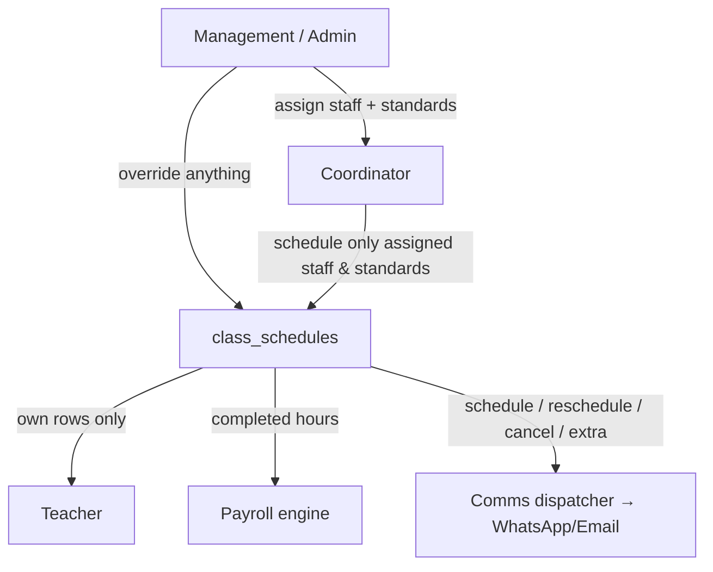
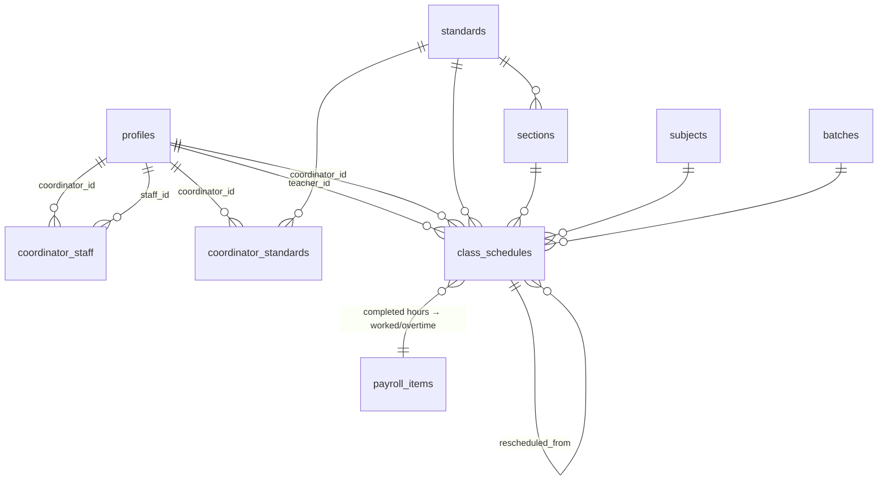
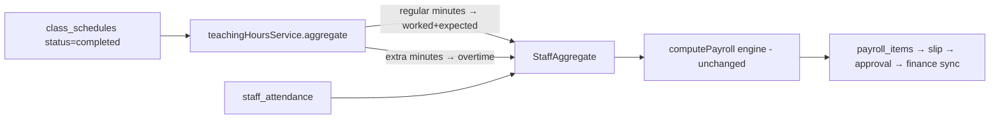
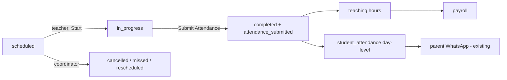
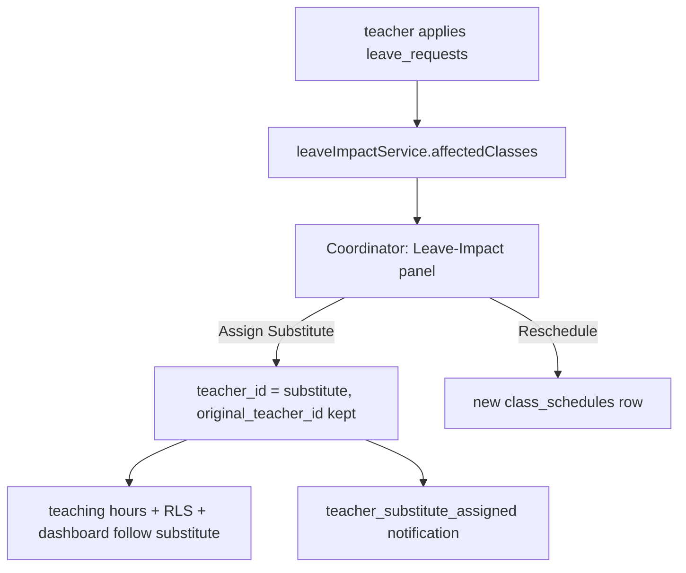

# Enterprise Academic Allocation Module

Coordinator management → class scheduling → teacher timetable → salary automation.
Fully dynamic (unlimited coordinators / standards / sections / teachers / batches),
RBAC-gated, built by **extending** the existing Payroll, Attendance, Communication,
RBAC and Dashboard modules — no duplicate engines.

> **Status:** Foundational core (Pass 1). Migration authored but **not applied**
> (`supabase/migrations/20260723_academic_allocation.sql`) — every service is
> missing-table-safe, so the app builds/runs before it is applied. Reports,
> analytics dashboards and the enterprise-readiness score are a follow-up pass.

---

## Role hierarchy

| Role | Can |
|------|-----|
| **Management/Admin** | Create coordinators (staff role), assign/transfer staff ↔ coordinators, assign standards, override schedules & payroll, org-wide view |
| **Coordinator** | Manage **only assigned** staff — assign standards/sections/subjects/timings, schedule/modify/cancel classes, approve extra classes, view workload & salary hours |
| **Teacher** | View **only own** classes, timetable, teaching + salary + extra hours, notifications |

---

## ER diagram

**New tables**

| Table | Purpose | Key columns |
|-------|---------|-------------|
| `sections` | dynamic sections per standard | `standard_id, name, sort_order` |
| `coordinator_staff` | staff ↔ coordinator (M2M) | `coordinator_id, staff_id, is_active` (UNIQUE pair) |
| `coordinator_standards` | coordinator scope (M2M) | `coordinator_id, standard_id` (UNIQUE pair) |
| `class_schedules` | the timetable | `teacher_id, coordinator_id, standard/section/subject/batch, schedule_date, start/end_time, duration_minutes (STORED generated), mode, room, meeting_link, repeat_weekly, is_extra, status` |

**New column:** `payroll_settings.include_teaching_hours` (bool, default false).

---

## Salary automation flow

Gated by `payroll_settings.include_teaching_hours`. When off, payroll behaves exactly
as before. The shared `computePayroll()` engine, slips, approval and finance-sync are
untouched — teaching hours simply feed the same `StaffAggregate` attendance already fills.

---

## RBAC permission matrix

Module `academics` (registered in `catalog.ts` + `actionCatalog.ts` + `menu.config.ts`;
build-gated by `registryAudit.test.ts` / `rbacRouteAudit.test.ts`).

| Action | Management | Coordinator | Teacher |
|--------|:--:|:--:|:--:|
| `academics.allocate_staff` | ✅ | — | — |
| `academics.transfer_staff` | ✅ | — | — |
| `academics.assign_standards` | ✅ | — | — |
| `academics.manage_sections` | ✅ | — | — |
| `academics.schedule_class` | ✅ (override) | ✅ | — |
| `academics.reschedule_class` | ✅ | ✅ | — |
| `academics.cancel_class` | ✅ | ✅ | — |
| `academics.extra_class` | ✅ | ✅ | — |
| `academics.view_workload` | ✅ | ✅ | — |
| `academics.view_my_classes` | — | — | ✅ |
| `academics.override` | ✅ | — | — |

Enforced at the DB by RLS on `class_schedules` (teacher → own rows; coordinator →
`coordinator_manages_staff()` + `coordinator_owns_standard()`; management/admin → all).

---

## Notifications (reuses comms dispatcher)

Events added to `communication/constants/automationEvents.ts`, recipient = teacher
(`profiles.mobile`), gated by `comms_automation_settings` (default OFF):
`teacher_class_scheduled`, `teacher_class_rescheduled`, `teacher_class_cancelled`,
`teacher_extra_class`. The teacher's live "My Classes" row is the in-app notification
(the shared `notifications` table is not teacher-readable by RLS).

---

## API surface (services)

| Service | Methods |
|---------|---------|
| `allocationService` | `listStaffLinks`, `staffIdsForCoordinator`, `assignStaff`, `removeStaff`, `transferStaff`, `listStandardLinks`, `standardIdsForCoordinator`, `assignStandard`, `removeStandard`, `listSections`, `createSection`, `deleteSection` |
| `scheduleService` | `list`, `get`, `create` (weekly-expand + notify), `update`, `setStatus`, `reschedule`, `remove` |
| `teachingHoursService` | `aggregate(from,to)`, `forTeacher(id,from,to)` |

Hooks: `useStaffLinks`, `useStandardLinks`, `useSections`, `useMyManagedStaffIds`,
`useMyStandardIds`, `useAllocationMutations`, `useSchedules`, `useMySchedule`,
`useScheduleMutations`, `useTeachingHours`, `useMyTeachingHours`.

---

## Modified / new files

**New**
- `supabase/migrations/20260723_academic_allocation.sql`
- `src/features/allocation/**` (types, services ×3, hooks ×3, schema, `pages/MyClassesPage.tsx`, tests ×2)
- `src/pages/management/StaffAllocation.tsx`
- `src/pages/coordinator/ClassScheduling.tsx`
- `docs/academic-allocation.md`

**Extended**
- RBAC: `rbac/constants/catalog.ts`, `actionCatalog.ts`
- Nav: `core/navigation/menu.config.ts`; keys: `core/constants/queryKeys.ts`
- Routing: `src/App.tsx` (teacher `my-classes`, coordinator/management `scheduling`, management `allocation`)
- Payroll: `payrollRun.service.ts` (teaching-hours merge), `payrollConfig.service.ts`, `types/payroll.types.ts`, `pages/PayrollSettingsPage.tsx`
- Comms: `communication/constants/automationEvents.ts`

---

## PASS / FAIL implementation matrix (Pass 1)

| # | Requirement | Status |
|---|-------------|:--:|
| 1 | Management assigns staff → coordinator (M2M) | ✅ |
| 2 | Transfer staff between coordinators | ✅ |
| 3 | Coordinator sees only assigned staff (RLS) | ✅ |
| 4 | Coordinator assigns standards/sections/subjects/timings | ✅ |
| 5 | Many-to-many everywhere (staff↔coord, coord↔standard, teacher↔standard) | ✅ |
| 6 | Dynamic — no hardcoded coordinators/standards/ranges | ✅ |
| 7 | Class timetable (offline/online, room, link, duration, statuses, weekly repeat) | ✅ |
| 8 | Status transitions: scheduled/completed/cancelled/missed/rescheduled | ✅ |
| 9 | Extra-class workflow + instant teacher notification | ✅ |
| 10 | Teacher dashboard: today/upcoming/completed/extra + salary hours | ✅ |
| 11 | Coordinator workload view (hours per teacher) | ✅ |
| 12 | Salary auto-accrual from completed teaching hours → payroll | ✅ (opt-in flag) |
| 13 | Notifications via WhatsApp/Email (settings-gated) | ✅ |
| 14 | RBAC registered + build-gated | ✅ |
| 15 | Unit tests (aggregation, weekly-expand) | ✅ |
| 16 | Management dashboard analytics (coordinator/teacher performance, forecast) | ⏳ deferred |
| 17 | Reports (PDF/Excel/CSV for 10 report types) | ⏳ deferred |
| 18 | Analytics (heatmaps/trends) | ⏳ deferred |
| 19 | Enterprise-readiness score / perf report | ⏳ deferred |

---

## Verification

1. `npm run test` — allocation + RBAC audit + payroll/comms suites green.
2. `npx vite build` — clean bundle (services degrade gracefully, migration unapplied).
3. Apply migration: `supabase db query --linked < supabase/migrations/20260723_academic_allocation.sql`
4. Manual E2E: Management assigns staff+standards → coordinator schedules a class + an
   extra class → teacher's *My Classes* + hours update, notification fires (if enabled) →
   enable *Include teaching hours* in Payroll Settings → generate a run for the period →
   completed class minutes appear in worked/overtime on the slip.

---
---

# Phase 2 — Academic Operations

Turns the allocation backbone into a **live operational loop**: class lifecycle,
per-class attendance, substitutes, leave integration, live-class linkage, workload
balancing, payroll validation and timetable lock — all by extending existing
modules (attendance/payroll/comms reused verbatim, never duplicated).

> **Status:** migration `supabase/migrations/20260724_academic_operations.sql` authored, **not applied**. All services missing-table-safe.

## Class lifecycle & attendance workflow

Class attendance **reuses** `attendanceStudentService.saveDay()` + `attendanceWhatsappService.notifyAbsentees()` (via `useSaveStudentAttendance`); `class_attendance` only adds per-class granularity.

## Substitute & leave

## Modified schema (Phase 2)

| Object | Change |
|--------|--------|
| `class_schedules` | +`original_teacher_id`, `started_at`, `completed_at`, `attendance_submitted`, `live_class_id`; status gains `in_progress` |
| `class_attendance` (new) | per-class rows: `class_schedule_id, student_id, status, remarks, marked_by` |
| `class_schedule_audit` (new) | append-only ops history: `action, actor_id, detail` |
| `timetable_locks` (new) + `is_timetable_locked(date)` | management freeze of a period |

## API surface (Phase 2)

| Service | Methods |
|---------|---------|
| `scheduleService` (extended) | `start`, `complete`, `submitAttendance`, `assignSubstitute`, `transfer` (+ lock-guarded create/update/reschedule) |
| `classAttendanceService` | `roster` (batch + fee-due + previous status), `list`, `upsert` |
| `leaveImpactService` | `affectedClasses(from,to,{teacherId})` |
| `timetableLockService` | `list`, `lock`, `unlock` |
| `payrollValidationService` | `buildDiscrepancy(from,to)` |
| `liveClassesService.create` (extended) | also mints a linked online `class_schedules` row |

Hooks: `useScheduleOps`, `useClassRoster`, `useSubmitClassAttendance`, `useLeaveImpact`, `useTimetableLocks`, `useTimetableLockMutations`, `usePayrollValidation`.

## Updated RBAC matrix (Phase 2 additions)

| Action | Mgmt | Coord | Teacher |
|--------|:--:|:--:|:--:|
| `academics.start_class` | ✅ | — | ✅ |
| `academics.mark_attendance` | ✅ | — | ✅ |
| `academics.assign_substitute` | ✅ | ✅ | — |
| `academics.transfer_class` | ✅ | — | — |
| `academics.lock_timetable` | ✅ | — | — |

RLS: `class_attendance` scoped via parent `class_schedules` (teacher own / coordinator manages / mgmt all); `timetable_locks` mgmt-write; substitute needs no RLS change (teacher_id swap).

## Modified / new files (Phase 2)

**New:** `supabase/migrations/20260724_academic_operations.sql`; `allocation/services/{classAttendance,leaveImpact,timetableLock}.service.ts`; `payroll/services/payrollValidation.service.ts`; `allocation/hooks/{useClassAttendance,useOperations}.ts`; `allocation/components/ClassAttendanceDialog.tsx`; `payroll/components/PayrollValidationPanel.tsx`; tests `{payrollValidation,leaveImpact}.test.ts`.
**Extended:** `allocation/services/schedule.service.ts` + `types`; `live-classes/services/liveClasses.service.ts`; `MyClassesPage.tsx`, `ClassScheduling.tsx`, `SalaryProcessingPage.tsx`; `rbac/constants/actionCatalog.ts`; `communication/constants/automationEvents.ts`; `queryKeys.ts`.

## PASS / FAIL matrix (Phase 2)

| # | Requirement | Status |
|---|-------------|:--:|
| 1 | Teacher class attendance (roster + fee-due + notes, own classes only) | ✅ |
| 2 | Attendance → student attendance + teaching/payroll hours + parent WhatsApp | ✅ (reuses existing pipeline) |
| 3 | Class lifecycle scheduled→in_progress→completed→attendance_submitted | ✅ |
| 4 | Coordinator cancel/reschedule/miss | ✅ (Phase 1 + audit) |
| 5 | Substitute teacher (hours + dashboard follow substitute, audit history) | ✅ |
| 6 | Leave integration (affected classes → reschedule/substitute) | ✅ |
| 7 | Live-class integration (auto-linked schedule → teacher dashboard) | ✅ |
| 8 | Workload balancing (Free/Overloaded/Underutilized) | ✅ |
| 9 | Payroll validation (scheduled/completed/cancelled/extra/leave/substitute/missing attendance) | ✅ |
| 10 | Management override (transfer, lock/unlock timetable) | ✅ |
| 11 | Teacher/Coordinator operational tiles (My Classes / Scheduling) | ✅ |
| 12 | RBAC (teacher own, coordinator assigned, mgmt all) | ✅ |
| 13 | No duplicate attendance/payroll/comms logic | ✅ |
| 14 | Management BI dashboard tiles (charts/forecast) | ⏳ out of scope (per request) |

## Deployment checklist (Phase 2)

1. Review both migrations (`20260723`, `20260724`).
2. Apply in order: `supabase db query --linked < .../20260723_academic_allocation.sql` then `.../20260724_academic_operations.sql`.
3. Verify realtime publication + `NOTIFY pgrst` ran.
4. In **Payroll Settings**, enable *Include teaching hours* when ready to pay from class hours.
5. In **Communication → Automation**, opt-in the `teacher_*` events.
6. `npm run test` + `npx vite build` green before deploy.
7. Smoke test the E2E loop below.

## E2E verification (Phase 2)
teacher **Start** → **Submit** class attendance → parent WhatsApp fires, class completes, hours+payroll update → coordinator **Assign Substitute** → hours move to substitute → teacher applies leave → coordinator sees **Leave Impact** → create a **live class** → linked schedule appears on teacher **My Classes** → open **Salary Processing** → **Payroll Validation** lists discrepancies → management **Lock Week** → coordinator edit refused.
